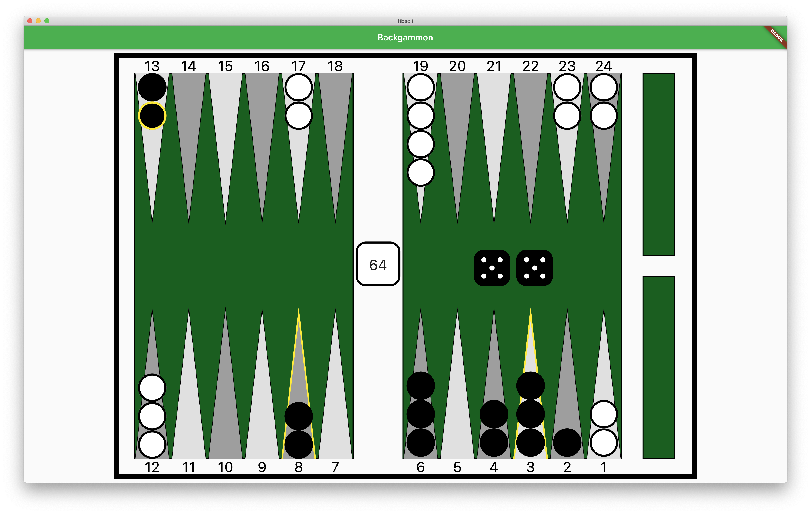

# fibscli
An eventual [FIBS](http://fibs.com) client written in Flutter and hosted on the web.

# status
The app works both as a stand-alone backgammon game (single-player and vs.
computer) **and** as a working FIBS client — login, live bot list, watch, and
tap-to-move play against bots on fibs.com. Browser builds reach FIBS through the
hosted Cloudflare Worker bridge in `packages/fibs_proxy_worker`.

# screenshot


You can try it live here: https://playfibs-f3c5b.web.app/#/

It works on desktop and mobile form factors.

All of the FIBS networking and bridge code now lives **in this repo** as
first-party source: `packages/fibscli_lib` for the Dart FIBS client and
`packages/fibs_proxy_worker` for the hosted WebSocket-to-telnet bridge. This repo
owns 100% of its source — there is no external upstream and nothing to sync to.

# FIBS development
The production web app uses the hosted Cloudflare Worker bridge:
`wss://proxy.playfibs.com/fibs`.

Local development can still run a developer-only
[websocat](https://github.com/vi/websocat) bridge. This is for contributors and
tests only; app users do not choose or provide a proxy.

If running JIBS locally, then configure websocat like this:

```sh
$ websocat --binary ws-l:127.0.0.1:8080 tcp:127.0.0.1:4321 --exit-on-eof -v
```

If running against fibs.com, then configure webtelnet like this:

```sh
$ websocat --binary ws-l:127.0.0.1:8080 tcp:fibs.com:4321 --exit-on-eof -v
```

Now running fibscli will use a websocket on port 8080 of the localhost to connect to either JIBS or FIBS as appropriate.

Run the Flutter app against the local development bridge with compile-time
developer overrides:

```sh
$ flutter run \
    --dart-define=fibs_proxy_host=127.0.0.1 \
    --dart-define=fibs_proxy_port=8080 \
    --dart-define=fibs_proxy_secure=false \
    --dart-define=fibs_proxy_path=
```

The Cloudflare Worker bridge has its own package:

```sh
$ cd packages/fibs_proxy_worker
$ npm ci
$ npm test
$ npm run check
$ npx wrangler whoami   # must be authenticated before deploy
$ npx wrangler deploy
```

## Production build & deployment

Build the release web bundle:

```sh
$ ./build-web.sh   # flutter build web --release --dart-define=FLUTTER_WEB_USE_SKIA=true
```

The output in `build/web` is a static bundle. To play FIBS from a deployed
build, the app uses the hosted Cloudflare Worker bridge. Users do not configure
the bridge; it is app infrastructure.

### Optional: remote crash reporting

Uncaught errors are always surfaced to the user (a SnackBar with a **Details**
view over the retained error log) and logged on-device. To *also* report them
off-device, supply a crash-report URL at build time:

```sh
$ flutter build web --release --dart-define=crash_report_url=https://example.com/crash
```

Each error is then POSTed as JSON (`context`, `error`, `stack`, `time`). With no
`crash_report_url` set, nothing leaves the device.

### Optional: the gnubg engine

**Play Gary Gammon** on the landing page offers five difficulty levels of
increasing strength (level 3 is a fast heuristic; 1-2 and 4-5 are the neural
engine). To also offer the world-class **GNU Backgammon** engine, point the
build at a gnubg-service:

```sh
$ flutter build web --release \
    --dart-define=gnubg_service_url=https://gnubg.example.com \
    --dart-define=gnubg_api_key=...   # optional, sent as x-api-key
```

With no `gnubg_service_url`, the gnubg engine is simply not listed.
