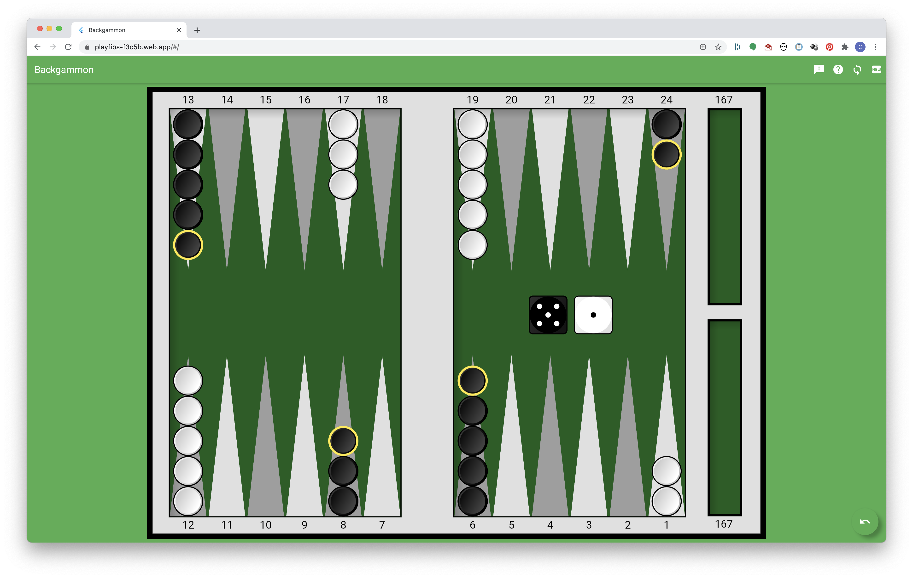

# fibscli
WIP: A FIBS client written in Flutter.

# status
I'm working on the adaptable UI now, both for form factor and for input, i.e. a mouse or a finger will do.

Also I'm working on the UI gestures themselves, e.g. selection showing legal moves, moving your pieces, etc.

The goal is to host it on the desktop and mobile web and make it work against the FIBS server on fibs.com. I've got a lot of the networking/websocket proxy code already written in my FIBS.NET repo.

# screenshot


# usage
fibscli uses [websocat](https://github.com/vi/websocat) to proxy from websockets to telnet.

If running JIBS locally, then configure websocat like this:

```sh
$ websocat --binary ws-l:127.0.0.1:8080 tcp:127.0.0.1:4321 --exit-on-eof -v
```

If running against fibs.com, then configure webtelnet like this:

```sh
$ websocat --binary ws-l:127.0.0.1:8080 tcp:fibs.com:4321 --exit-on-eof -v
```

Now running fibscli will use a websocket on port 8080 of the localhost to connect to either JIBS or FIBS as appropriate.

# FIBS TODO
- live chat
- watch backgammon
- play backgammon

# UI TODO
- allow users to provide feedback
- publish to github.io
- log remaining bugs (and remove TODOs from this README)
- implement the forced moves rules (according to https://www.bkgm.com/rules.html)
- move a hit piece *after* it's been hit
- draw moving pieces on top of other pieces
- don't show the label while it's moving
- don't flip a piece to it's edge while it's moving
- prefer moves w/ hits when picking from multiple moves
- show end game stats (# of doubles/player, total of dice rolls/player)
- auto bearoff (greedy)
- support doubling